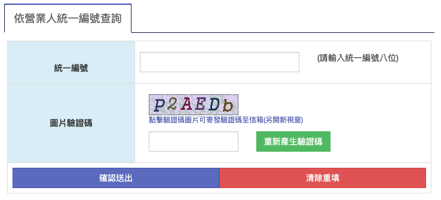
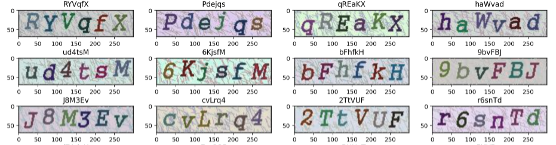
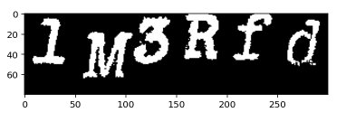
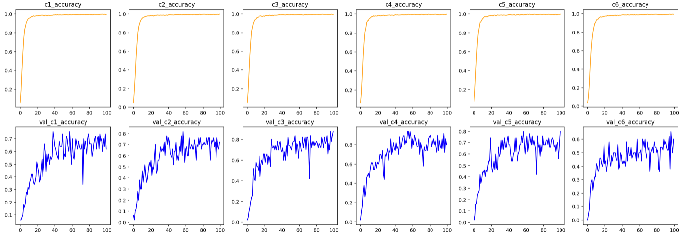
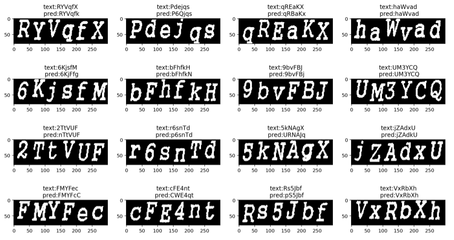

# Captcha-detector-CNN

## Introduction
In order to crawl data on [財政部](https://www.etax.nat.gov.tw/cbes/web/CBES113W1_1), we need to identify characters in captcha (圖片驗證碼). Besides online captcha-detection API services, we can train our own Deep Learning models as captcha detector.

## Exploration
Before starting, let us observe some captcha images in this case. According to following captchas, we can get some ideas.

- There are **6 characters** in every captcha
- characters shift a little in every captcha
- Only alphabet and numeric included in captcha

## Dataset
I use OpenCV with similar fonts to generate training captcha.

## Data Preprocessing
To make data simpler, I turn input image from RGB(3 channel) to gray scale(1 channel), then binarilize image (thres=150).

## Model
Because of fixed character number in captcha, it's intuitive to build an 6 with CNN backbone.
- For each output, it predict each character's probabiity.
- Here I use VGG structure as model backbone.

## Training Result
Each output validation accuracy is around 60% to 80%

## Evaluation

